# market-agent

> An evidence-backed finance research terminal with a tool-using analyst, a structured `Block[]` renderer, and background research agents — built around the rule that *no displayed number ever exists without a backing row of provenance*.

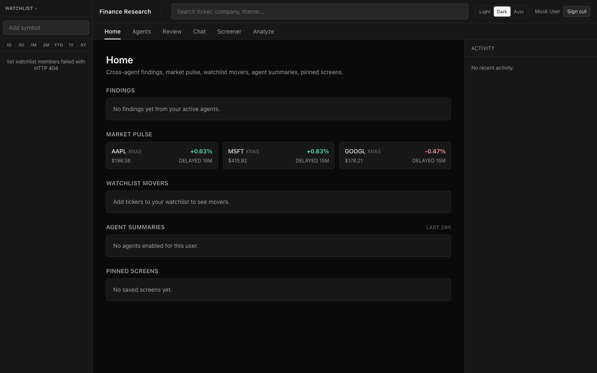

[](https://react.dev)
[](https://vite.dev)
[](https://www.typescriptlang.org)
[](https://nodejs.org)
[](https://www.postgresql.org)
[](https://redis.io)
[](https://min.io)
[](https://docs.docker.com/compose/)

---

## Table of contents

1. [About](#about)
2. [Features](#features)
3. [Screenshots](#screenshots)
4. [Architecture](#architecture)
5. [Invariants](#invariants)
6. [Project structure](#project-structure)
7. [Getting started](#getting-started)
8. [Usage walkthrough](#usage-walkthrough)
9. [Architecture Decision Records](#architecture-decision-records)
10. [Non-goals](#non-goals)
11. [Roadmap](#roadmap)
12. [Contributing](#contributing)

---

## About

`market-agent` is the implementation of the architecture in [`stock-agent-v2.md`](stock-agent-v2.md): a desktop-first finance-research terminal whose central insight is that an app like this is **not "a chatbot with charts" — it is an evidence system plus a structured artifact renderer plus a tool-using analyst.**

The system is built as three subsystems on one shared data plane:

1. **Deterministic terminal surfaces** — watchlists, quotes, charts, symbol detail tabs, screener, portfolio overlay.
2. **Interactive research chat** — strict `Block[]` responses, a tool-using analyst, citations and provenance, persistent threads, cross-thread artifacts.
3. **Background thesis agents** — scheduled research, claim/event monitoring, finding generation, notifications, and a Home feed that is findings-first, not news-first.

The model never emits HTML, JSX, or markdown for analyst replies. It emits a typed array of blocks (`RichText`, `Section`, `MetricRow`, `Table`, `LineChart`, `RevenueBars`, `PerfComparison`, `SegmentDonut`, `Sources`, `Disclosure`, …) that the frontend `BlockRegistry` renders. Every numeric reference inside prose is bound to a `Fact` or `Computation` by id, so the verifier can guarantee narrative and visuals can never disagree.

---

## Features

Mapped to the build phases in [`stock-agent-v2.md` §23](stock-agent-v2.md):

- ✅ **Phase 0 — Foundation** — app shell, route model, auth gate primitives, subject resolver (`issuer` / `instrument` / `listing` / `theme` / `macro_topic` / `portfolio` / `screen`), watchlists, symbol search, quotes.
- ✅ **Phase 1 — Terminal core** — symbol detail surfaces (overview, financials, earnings, holders, signals), market data with adjusted-series caching, fundamentals with SEC normalization, screener, portfolio/watchlist basics.
- ✅ **Phase 2 — Structured chat** — per-thread session coordinator with SSE replay, pre-resolve router with budget policy, versioned `BlockRegistry`, snapshot assembler & verifier, thread summaries/titles, durable-runtime parity with Durable-Object semantics ([ADR 0004](docs/adr/0004-session-coordinator-hosting.md)).
- ✅ **Phase 3 — Document & evidence plane** — sources, documents, mentions, claims, claim arguments, entity impacts, events, candidate-fact promotion, evidence bundles, claim clustering, XBRL extension parsing, segment & non-GAAP extraction.
- ✅ **Phase 4 — Product parity** — themes & macro subjects, Analyze template system, "Add results to chat" artifact flow, Home feed cluster-dedupe & ranking, right-rail activity stream (`Reading` / `Investigating` / `Found` / `Dismissed`), specialized social/news blocks, dynamic watchlists with portfolio overlays.
- ✅ **Phase 5 — Background agents** — agent CRUD with scheduling and watermark storage, alert evaluation, finding generation, multi-channel notification delivery (email · push · digest).
- 🚧 **Phase 6 — Hard cases & scale** — segment refinement, non-US coverage, reviewer queues, export/share policies, deeper drift monitoring. The drift command (`services/observability && npm run drift:monitor`) ships today; the rest is the active frontier.

All 298 implementation issues tracked in [beads](https://github.com/scottfeldman/beads) are closed; the codebase is the source of truth.

---

## Screenshots

| | |
|---|---|
|  **Home** — findings feed deduped by `ClaimCluster`, market pulse, watchlist movers, agent summaries (last 24 h), saved screens. | 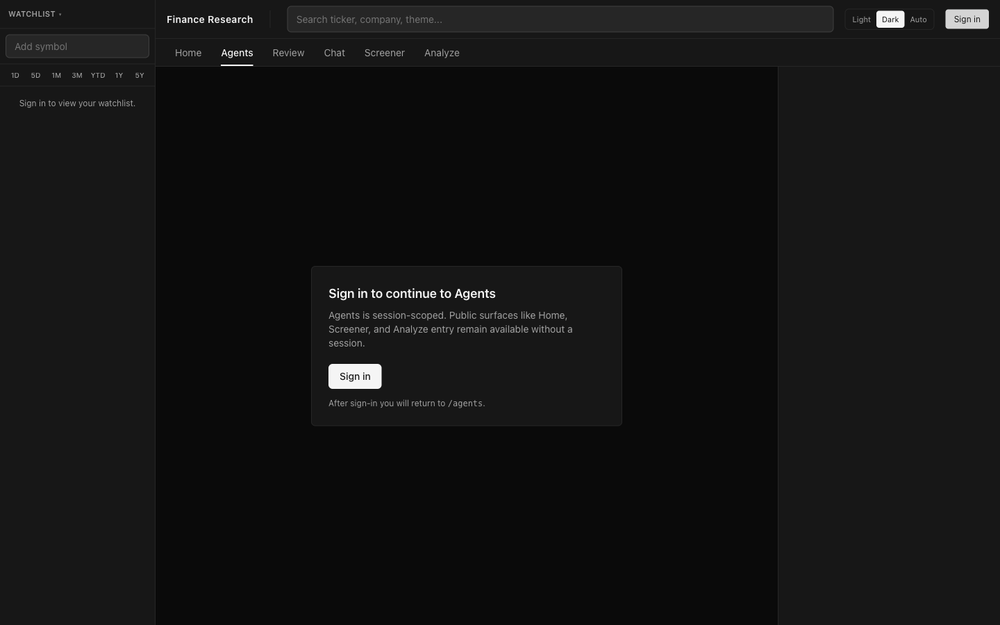 **Auth gate** — protected surfaces collapse the main canvas to a session prompt; the shell chrome stays mounted ([§3.10](stock-agent-v2.md)). |
| 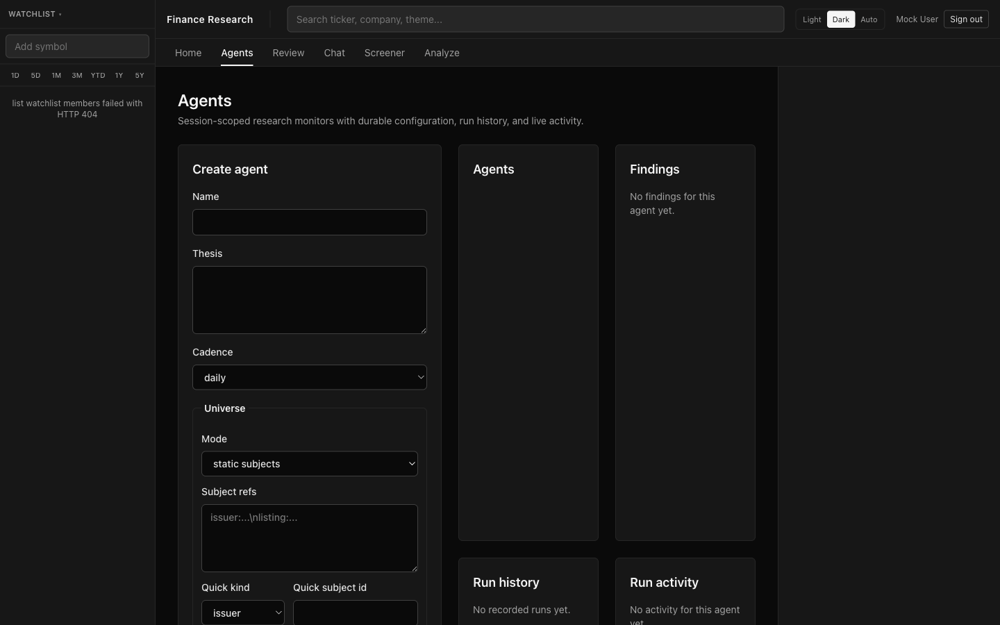 **Agents** — durable thesis agents with name, thesis, cadence, universe (static / dynamic), run history, and live run activity. | 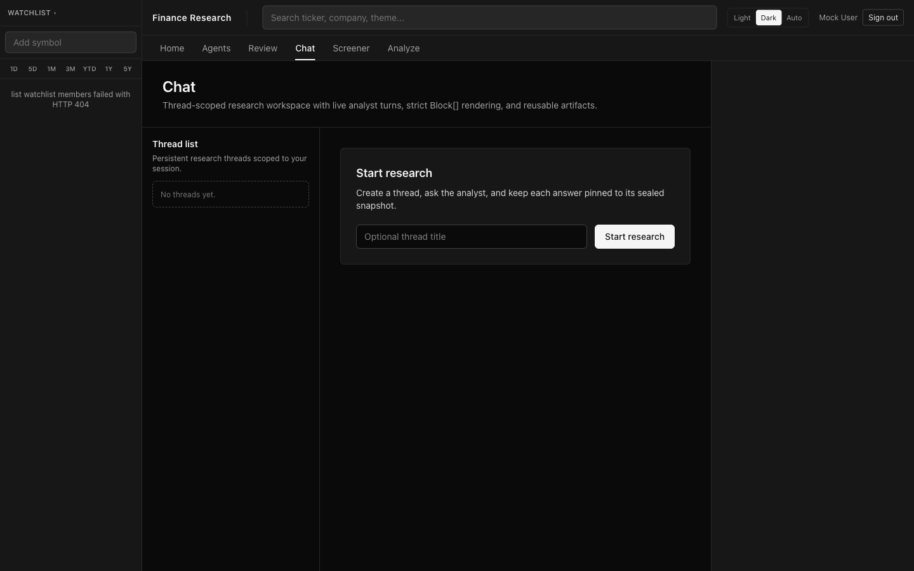 **Chat** — thread-scoped research workspace; each answer is pinned to a sealed snapshot. |
| 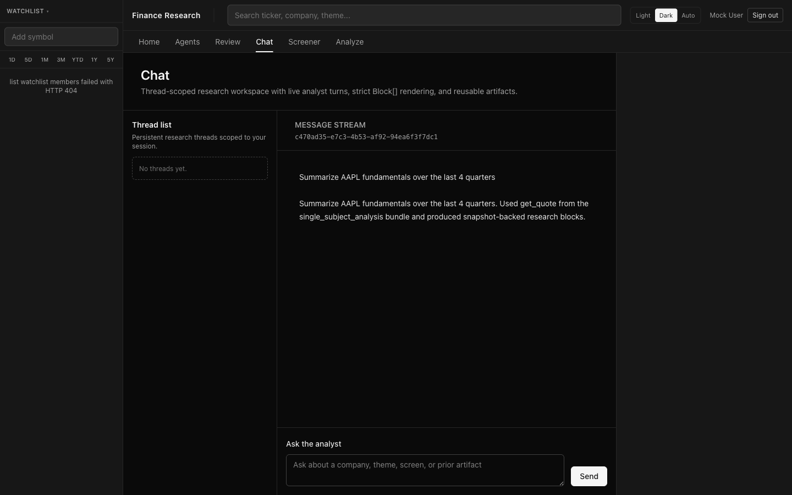 **Chat thread** — analyst replies stream as `Block[]`, never raw markdown; old blocks remain interactive in their snapshot. | 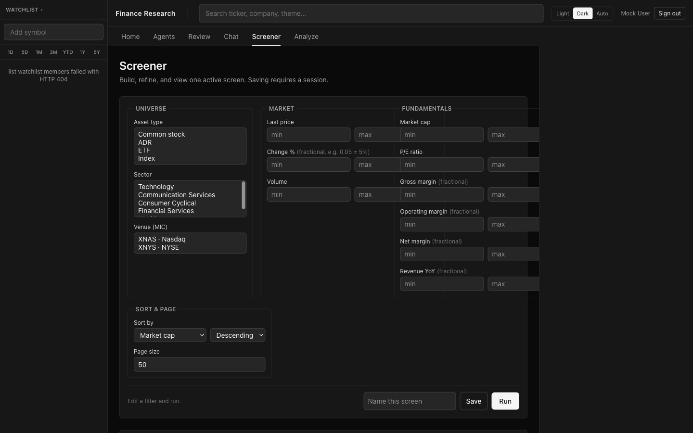 **Screener** — universe + market + fundamentals filters; saved screens feed watchlists, agents, and template universes. |
| 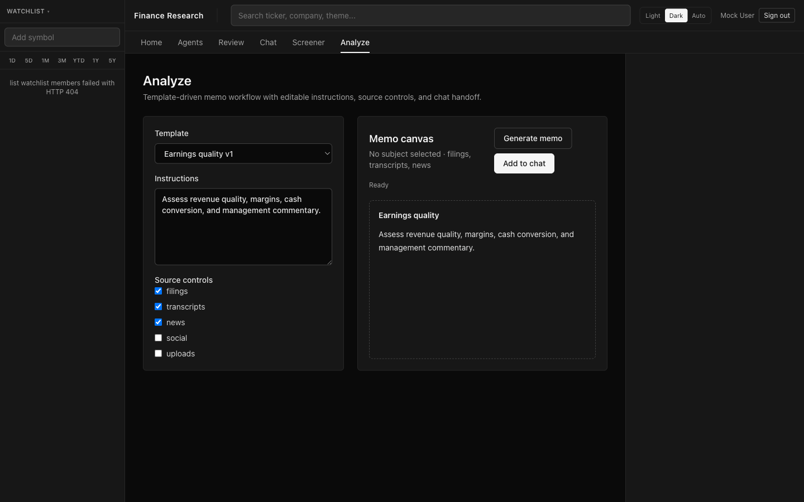 **Analyze** — template-driven memo workflow with editable instructions, selectable source categories, and chat handoff via shared snapshot provenance. | 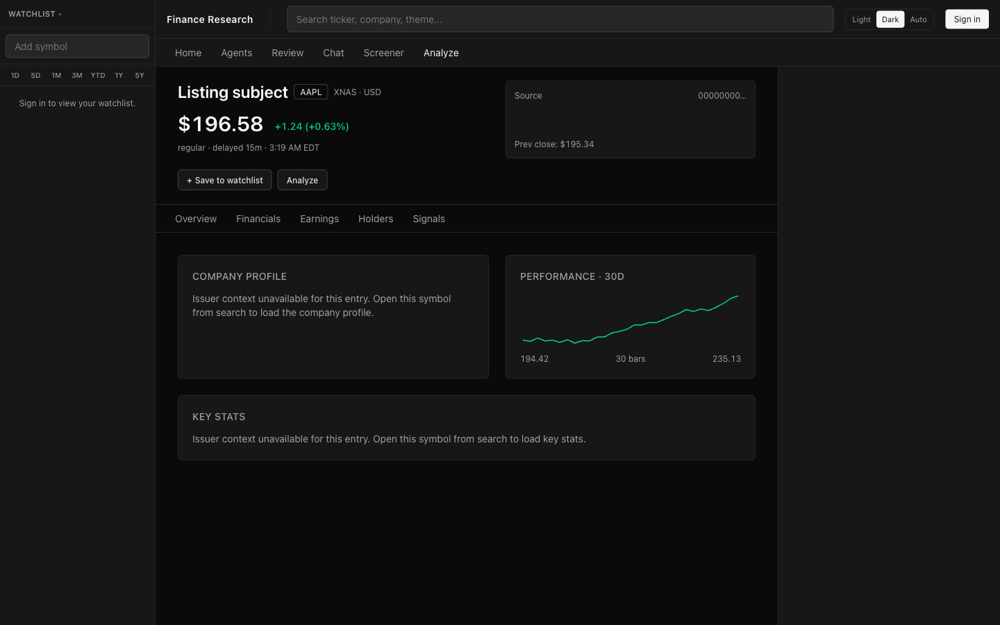 **Symbol / Overview** — KPI tiles, sealed performance chart, source provenance. |
| 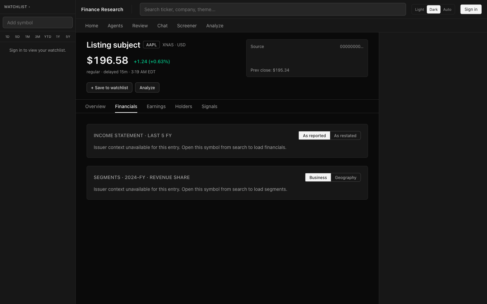 **Symbol / Financials** — income statement (as reported / as restated) + segment revenue share with business / geography pivot. | 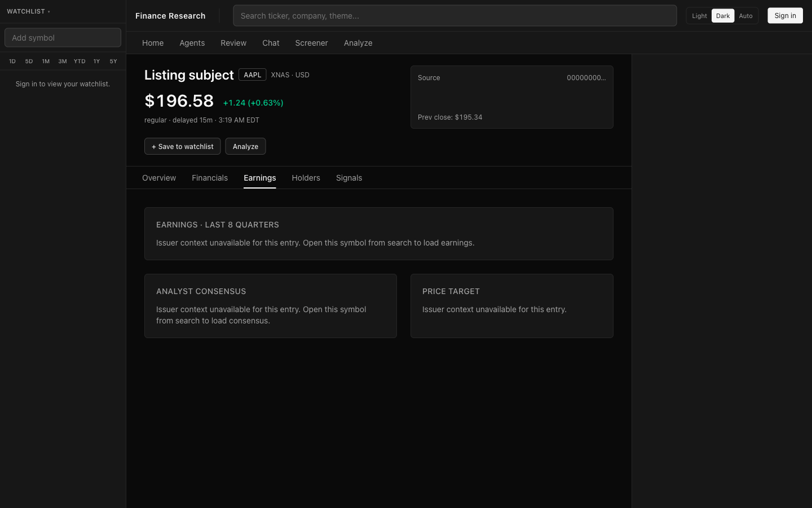 **Symbol / Earnings** — last 8 quarters, analyst consensus, price target. |
|  **Symbol / Holders** — institutional holders and insider transactions. | 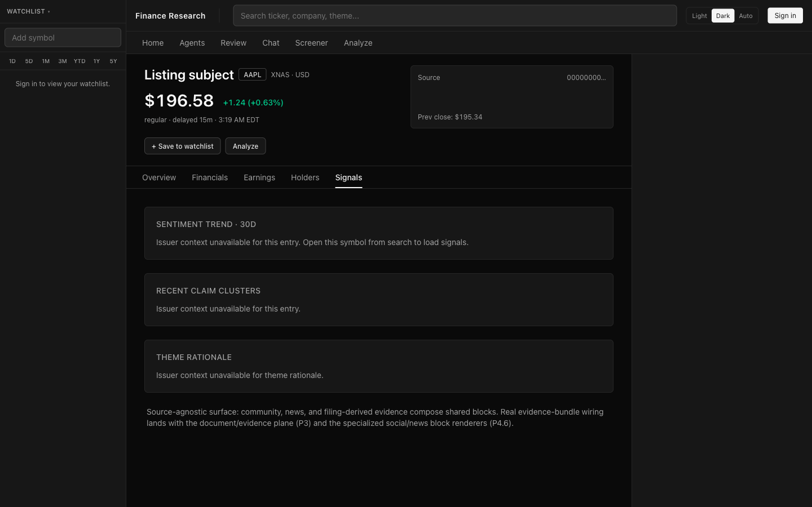 **Symbol / Signals** — sentiment trend, recent claim clusters, theme rationale (the supersession of the older `/reddit` route). |

---

## Architecture

```text
Client (Web · Electron-ready)
        │
        ▼
API / BFF Layer
(auth, thread routes, Home, Agents, Analyze, Screens, SSE bootstrap)
        │
        ▼
Session Coordinator   (Node + Postgres today; Durable-Object-equivalent semantics — ADR 0004)
        │
        ▼
Orchestrator
(intent · bundle selection · budgets · approvals · snapshot staging)
        │
        ├──────────────────────────────┐
        ▼                              ▼
Deterministic Services         Model Services
(resolver · calculators ·      Reader  · Analyst
 normalizer · verifier ·       Title/Summary
 snapshot sealer)
        │
        ▼
Tool Gateway
        │
        ┌──────────────┬─────────────┬──────────────┬────────────────────┬──────────────────┐
        ▼              ▼             ▼              ▼                    ▼                  ▼
Identity / Resolver   Market Data   Fundamentals   Evidence Service    Screening / Alerts   Home Feed
                                                  (docs · facts ·      / Notifications
                                                   claims · events)
        │
        ▼
Storage
- App metadata (Postgres)
- Evidence (Postgres, partitioned by time/class)
- Raw documents & parsed artifacts (MinIO/S3 — `BLOB_STORE_BACKEND=memory|s3`)
- Hot session cache (Redis)
```

The model topology has **five execution roles**, each with a different blast radius:

| Role | What it sees | What it can do |
|---|---|---|
| **Resolver / router** | user text, thread summary, auth state | extract subjects, resolve periods, pick a tool bundle, set budgets |
| **Reader** | raw documents (HTML, PDF, transcripts, tweets) + extraction schema | emit structured claims, events, candidate facts, mentions, impacts |
| **Analyst** | bundle tools, structured tool results, response schema — **never raw external text** | call read-only tools, emit a `Block[]` reply |
| **Verifier** | the proposed `Block[]`, the manifest, the snapshot contract | accept/reject for schema validity, ref bindings, units, disclosures, approvals |
| **Summary / title** | sealed turn | async summaries for thread titles, finding cards, Home headlines |

The reader/analyst boundary is what contains prompt-injection risk from external content: only the reader sees raw text; the analyst consumes only typed extractions.

---

## Invariants

These eight rules govern the system. They are checked by code, not by convention.

| # | Rule |
|---|---|
| **I1** | No displayed number without a backing `Fact` or `Computation` row. |
| **I2** | Narrative and visuals cannot disagree — prose binds facts by id, not by repetition. |
| **I3** | Documents are evidence, not truth. Articles, tweets, transcripts, and uploads do not become canonical facts merely by being ingested. |
| **I4** | The analyst never sees raw untrusted text — only structured reader output. |
| **I5** | Every answer is pinned to an immutable `snapshot_id`. |
| **I6** | Multi-entity reasoning happens through claim arguments and entity-impact edges, not document mentions. |
| **I7** | Side effects (alerts, exports, agent creation) require explicit user approval. |
| **I8** | Refresh is explicit — interactivity inside a sealed snapshot is allowed only for `allowed_transforms`. |

The snapshot contract (see [`stock-agent-v2.md` §15](stock-agent-v2.md)) is what lets a chart block inside an old assistant message stay interactive — its timeframe buttons resolve inside the snapshot's `allowed_transforms` against the same `as_of` and basis the message was sealed with.

---

## Project structure

```
market-agent/
├── web/                       React 19 + Vite frontend; BlockRegistry renderer
├── services/
│   ├── resolver/              identity (issuer / instrument / listing / theme)
│   ├── market/                quotes, bars, normalized & adjusted series
│   ├── fundamentals/          SEC company-facts ingestion + statement normalization
│   ├── evidence/              docs · claims · events · facts · XBRL & non-GAAP extraction
│   ├── screener/              filter / rank queries over the universe
│   ├── home/                  findings dedupe + ranking + market pulse
│   ├── agents/                CRUD · scheduling · alert eval · finding generation
│   ├── notifications/         email · web push · digest delivery
│   ├── chat/                  SSE thread coordinator + analyst runtime
│   ├── snapshot/              manifest staging + verification
│   ├── observability/         drift monitoring (npm run drift:monitor)
│   ├── analyze/               Analyze tab memo workflow
│   ├── artifact/              shared artifact model (add-to-chat)
│   ├── themes/ summary/ portfolio/ watchlists/ tools/ shared/ dev-api/
├── db/                        schema pack, migrations, seeds
├── spec/                      block schema, OpenAPI, tool registry, finance-research spec
├── docs/
│   ├── adr/                   Architecture Decision Records
│   └── screenshots/           README assets
├── scripts/                   dev-shell.sh + helpers
├── docker-compose.dev.yml     Postgres 15 · Redis 7 · MinIO
├── .env.dev.example           ports + flags
└── stock-agent-v2.md          source-of-truth architecture document
```

---

## Getting started

### Prerequisites

- **Node ≥ 22.6** (the services use `node --experimental-strip-types` for direct `.ts` execution)
- **Docker + Docker Compose** (Postgres / Redis / MinIO containers)
- ~3 GB free for images and dependencies

### Setup

```bash
cp .env.dev.example .env.dev      # ports + flags; safe defaults
./scripts/dev-shell.sh up         # first run installs ~12 npm packages, pulls images, runs migrations + seeds
./scripts/dev-shell.sh status     # confirms all services are running
```

When `up` completes, the app is at **<http://localhost:5173>**.

The dev shell brings up:

| Surface | Address | What it serves |
|---|---|---|
| `web` | <http://localhost:5173> | Vite dev server (the UI) |
| `chat` | <http://localhost:4310> | SSE thread coordinator + analyst runtime |
| `resolver` | <http://localhost:4311> | identity / subject resolution |
| `dev-api` | <http://localhost:4312> | local BFF (`/v1/agents`, `/v1/analyze`) |
| `watchlists` | <http://localhost:4313> | manual + dynamic watchlists |
| `market` | <http://localhost:4321> | quotes, bars |
| `fundamentals` | <http://localhost:4322> | profile, statements, key stats |
| `screener` | <http://localhost:4323> | filter/rank |
| `portfolio` | <http://localhost:4333> | holdings, currency basis |
| `home` | <http://localhost:4334> | findings feed + market pulse |
| `evidence` | <http://localhost:4335> | docs, claims, events, facts |
| `postgres` | `127.0.0.1:54329` | metadata + evidence DB |
| `redis` | `127.0.0.1:63791` | session cache |
| `minio` | <http://localhost:9001> (console) | raw-document object store |

`artifact`, `notifications`, `snapshot`, `tools`, `themes`, `summary` ship as in-process libraries — they don't bind their own dev HTTP ports.

### Tear down

```bash
./scripts/dev-shell.sh down
```

This stops the service processes and runs `docker compose down`. State persists in Docker volumes.

### Dev-mode authentication

Auth in development is an in-memory mock (`web/src/shell/AuthContext.tsx`). The "Sign in" button in the top bar — and the same button inside the AuthGate panel — sets a stable mock UUID so persistent surfaces (watchlists, threads, portfolios) round-trip the same `user_id` across runs. The real provider plugs in later without changing the `RouteScopeGate` / `AuthGate` contract.

For dev parity with the FK-enforced schema, the mock user must exist in `users`:

```sql
INSERT INTO users (user_id, email, display_name)
VALUES ('00000000-0000-4000-8000-000000000001', 'mock@dev.local', 'Mock User')
ON CONFLICT (user_id) DO NOTHING;
```

A `users_default_manual_watchlist` trigger then creates that user's default watchlist automatically.

---

## Usage walkthrough

### Home
Opens to the cross-agent findings feed deduped by `ClaimCluster`, plus a market-pulse strip (default seeds: AAPL, MSFT, GOOGL — configurable via `HOME_PULSE_LISTINGS` in `.env.dev`), watchlist movers, last-24-h agent summaries grouped by severity, and pinned screens. No sign-in required to land; sign-in is required to load the user-scoped sections.

### Symbol detail
Type a ticker into the top search (e.g. `AAPL`). The resolver maps it to a canonical `SubjectRef` like `listing:11111111-1111-4111-a111-111111111111` and lands at `/symbol/<ref>/overview`. The five tabs are **Overview · Financials · Earnings · Holders · Signals** (the source-agnostic supersession of the older `/reddit` draft route — community, news, and filing-derived evidence all compose through the same shared blocks). Charts and tables are sealed against an immutable snapshot per [§15](stock-agent-v2.md): timeframe buttons resolve inside the snapshot's `allowed_transforms`; anything else triggers a refresh.

### Chat
Protected surface — sign in via the top-bar button or the AuthGate panel. New threads are created from the empty state. Messages stream via SSE; the analyst's reply arrives as a `Block[]` (typed `RichText`, `Section`, `MetricRow`, `Table`, `LineChart`, etc.) — never raw markdown. Old blocks stay interactive in their sealed snapshot. The right rail shows the activity stream (`Reading` / `Investigating` / `Found` / `Dismissed`); the left rail lists threads scoped to the session.

### Analyze
A template-driven memo workflow. Pick a template (e.g. *Earnings quality v1*), edit the instructions, toggle source categories (filings · transcripts · news · social · uploads), optionally add peer/benchmark subjects, and **Generate memo** to produce a structured `Block[]` memo using the same renderer as Chat. **Add to chat** copies the memo blocks into a thread with shared snapshot provenance.

### Screener
Filter the universe across asset type, sector, venue (MIC), market metrics (price, change %, volume) and fundamentals (market cap, P/E, gross/operating/net margin, revenue YoY). Sort + paginate. Save the screen — saved screens feed watchlists, agent universes, and Analyze peer policies.

### Agents
Protected. Create a thesis agent with a name, thesis, cadence (daily / weekly / on-demand), and universe (static subjects, dynamic via screen / theme / portfolio). The agent's run loop ingests new evidence since its watermark, runs the reader extraction, scores claims against the thesis, emits findings, and updates the activity stream. Findings flow to Home; alerts deliver via email / web push / digest per the agent's rules. Run history and run activity are visible per agent.

---

## Architecture Decision Records

| ADR | Subject | Summary |
|---|---|---|
| [0001](docs/adr/0001-frontend-state-management.md) | Frontend state management | React-local state + focused shell contexts now; TanStack Query / Zustand deferred until shared-cache pressure justifies them. |
| [0002](docs/adr/0002-chart-engine-strategy.md) | Chart engine strategy | Deterministic SVG/HTML chart blocks now; TradingView Lightweight Charts / Recharts / Visx remain migration options when triggers are met. |
| [0003](docs/adr/0003-filing-extraction-boundary.md) | Filing extraction boundary | Filing extraction is an internal sub-boundary across Evidence + Fundamentals — not a standalone `services/filing-extraction` — until throughput or ownership demand a split. |
| [0004](docs/adr/0004-session-coordinator-hosting.md) | Session coordinator hosting | Node + Postgres coordinator with sticky-routing parity to Cloudflare Durable Objects' per-thread serialization, SSE replay, durable run outputs, and idempotent queue handling. |

---

## Non-goals

The plan deliberately avoids:

- live market streaming inside sealed assistant messages
- raw web access by the analyst
- brokerage execution and any implicit trading workflow
- exposing model chain-of-thought
- using document mentions as a proxy for entity impact
- treating tweets or Reddit posts as authoritative facts

This is a **research** system, not a trading platform.

---

## Roadmap

The active frontier is **Phase 6 — Hard cases & scale**:

- segment-extraction refinement (non-standard XBRL extensions, redefinition events)
- non-US issuer coverage (multi-domicile reporting, FX-aware fundamentals)
- reviewer queues for low-confidence extractions
- export / share policies with disclosure preservation
- deeper evals & drift monitoring (the `eval_run_results` + drift report pipeline ships today; expand the golden set)

Open ADR-trigger watch:

- ADR 0001 — when shared cache / store pressure crosses its trigger, migrate to TanStack Query + Zustand.
- ADR 0002 — when interactive chart density or perf demands exceed deterministic SVG/HTML, migrate to TradingView Lightweight Charts.
- ADR 0003 — when filing-extraction throughput or ownership requires it, split into `services/filing-extraction`.
- ADR 0004 — if a Cloudflare-centric deployment is preferred, swap the coordinator adapter to Durable Objects without changing the equivalence contract.

---

## Contributing

Conventions for AI-assisted contributions live in [`AGENTS.md`](AGENTS.md). The architectural source of truth is [`stock-agent-v2.md`](stock-agent-v2.md); changes that affect those invariants should land an ADR alongside the code.
